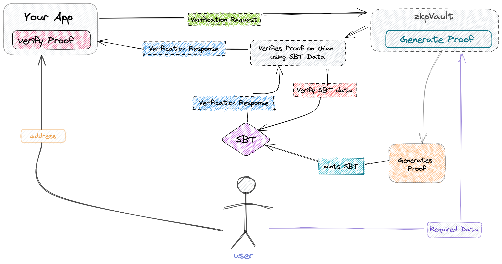

## zkVault
> Tokenize your Privacy Protected on-chain Identity

zkpVault is the solution to the problem of people having to give out way too much personal info just to prove who they are or what they can do. With zkpVault, you can give just the proof you need without giving away any extra details. This is great because it makes things more private, more streamlined, and more secure. zkpVault is totally changing the game by giving us a place to keep and check proofs, and it's making online services way more trustworthy for everyone involved. It works on Zero knowladge technology

### Userflow

Proofs are non-transferable tokens (SBTs) that represent verifiable claims authenticated by zkpVault.

When minting a Proof, a user generates a proof to authenticate an anonymized verifiable claim about some data that only they own. Then using snarkjs and Groth16 a proof is generated and proof is then verified and tokenized as a SBT by zkpVault—smart contracts that convert proven data into non-transferable tokens (SBTs) As SBT are issued as tokens on-chain, they are compatible with the burgeoning ecosystem of web3 applications. As such, Badges represent verified acts about a user’s digital identity. For example, a user could have a ZK SBT proving they have a certain threshold of Twitter followers

# More Information
For more information about this project, please visit the Devfolio project page.

